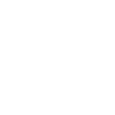

# Ola, eu sou o Célio Costa 👋

## Introdução Sobre Mim 🧭
- 👨‍👩‍👧 Sou casado com a Marcia e pai da Nicole
- 🧙 Trabalho com desenvolvimento de sistemas a 16 anos
- 🔭 Atualmente trabalho com desenvolvimentos em:
    - ✔  **.Net Core**
    - ✔  **Xamarin.Forms**
    - ✔  **Angular**
    - ✔  **Back-end em C#**
    - ✔  **Flutter**
    - ✔  **Levantamento de Requisitos e Documentação**
- 📓 Tecnologias que estou estudando:
    - 👨‍🎓 Java Script
    - 👨‍🎓 Node
    - 👨‍🎓 Docker
    - 👨‍🎓 Dart
- 👨‍🎓 Outros assuntos que estudo:
    - 👓Arquitetura de Software e seus Principios (SOLID)
    - 👓Ingles
- 👨‍🎓 Livros Favoritos:
    - 📚 O Mitico Homem-Mês - Frederick P. Brooks JR.
    - 📚 The Clean Coder - Robert C. Martin
    - 📚 Arquitetura Limpa - Robert C. Martin
    - 📚 Código Limpo - Robert C. Martin
    - 📚 Refatoração -Martin Fowler
    - 📚 Extreme Programming Explained: Embrace Change - Kent Beck & Cynthia Andres
    - 📚 TDD Desenvolvimento Guiado por Testes - Kent Beck
    - 📚 Test-Driven Development: Teste E Design No Mundo Real Com .Net - Mauricio Aniche
    - 🧙‍♂️ Todos os Livros do Tolkien
##

## Estatísticas 📑

    

     
    
    
     
     
    
    
    
      
        
      
             
    

<!--
**celiorscosta/celiorscosta** is a ✨ _special_ ✨ repository because its `README.md` (this file) appears on your GitHub profile.

Here are some ideas to get you started:

-->
